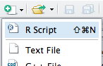

R and Google Map Making
======================

## R Basics

R began as a statistics program, and is still used as one by many users. At a simple level you can type in "3 + 4", press return, and R will respond "7". Try the example below. Code for you to type into R is shown like this:

```{r, comment=NA, eval=FALSE}
3 + 4
```

Then R's output is shown like this: 

```{r, echo=FALSE, comment=NA}
7
```

R has developed into a GIS as a result of user contributed packages, or libraries, as R refers to them. We will be using several libraries in this practical, and will load them as necessary. 

*If you are using this worksheet outside of the course, you may need to install the R libraries as well as loading them. To do this, run 'install.package("package_name")'.*

We won't spend too much time on the basics of using R - if you want to find out more, there are some good tutorials at http://www.social-statistics.org/?p=764 or http://rpubs.com/nickbearman/gettingstartedwithr. 

We are going to use a program called [R Studio](http://www.rstudio.com/ "R Studio website"), which works on top of R and provides a good user interface. I'll talk a little bit about it in the presentation, but the key areas of the window are these:


Open up R Studio (click Start > All Programs > RStudio > RStudio or double-click the icon on the desktop) and arrange the windows so you can see the instructions in the web browser along side R Studio. 

One of the libraries we will use is `ggmap`, which allows us to quickly and easily include some Google Maps within R. First, we need to load the library, so type into the console:

```{r, comment=NA, message=FALSE}
library(ggmap)
```

This will load various other libraries and you will probably see some black information messages. If you see any red error messages, then ask for help. 

We can then create a quick map of Liverpool with the `qmap()` function. You should see the map appear in the 'Plots' window to the left of the R Studio window. 

```{r, comment=NA, message = FALSE}
qmap('Liverpool')
```

We can also search for anything we would search for in the Google Maps search box - e.g. different locations, or postcodes. For example, try: 

```{r, comment=NA, message = FALSE, eval=FALSE}
qmap('CH1 1AA')
```

Try different postcodes or locations to search for, and see what happens. You will see that the scale of the map stays the same - this is fine for Liverpool, but of limited use for somewhere smaller (like Norwich) or larger (like Ireland). The default zoom is level 10, but we can change this to something more useful. Higher numbers zoom in more (i.e. show a smaller area). Try:

```{r, comment=NA, message = FALSE}
qmap('L69 3GP', zoom = 16)
```

This shows us the map centred on the Jane Herdman building (although it isn't marked on the map). 

As well as the maps layer, we can access the satellite and hybrid map types from Google Maps:

```{r, comment=NA, message = FALSE}
qmap('L69 3GP', zoom = 16, maptype = 'satellite')
```

One useful shortcut when using R Studio (or R on its own) is that pressing the 'up' key on the keyboard will show your previous command. You can then edit this and press return to run it, which avoids the need to type the whole command out again! Try it with the command below:

```{r, comment=NA, message = FALSE, eval=FALSE}
qmap('L69 3GP', zoom = 16, maptype = 'hybrid')
```

## Plotting Spatial Data

We have seen some examples of using the different basemap types, and using R we can also plot spatial data on top of these basemaps. We are going to use an example of crime data, available from the [Police.uk](Police.uk) website. We have downloaded the data for you, but if you want to find out how to access it for a different area, have a look at http://rpubs.com/nickbearman/gettingstartedwithr. 

R uses what it calls a working directory, which is a folder where it will store the files you are currently working on. In the 'Documents' folder, create a folder called 'GIS'. We will then tell R to use this folder as its working directory. Run the command below. 

```{r eval=FALSE}
# Set working directory
setwd("M:/Documents/GIS")
```

```{r,echo=FALSE,comment=NA,results='hide'}
setwd("/Users/nickbearman/Dropbox/teaching/2014-liverpool/2014-r-google-workshop/practicals/r-google-map-making")
```

We are going to make use of some data available from the Police.uk site. You can download it yourself from http://data.police.uk/data/, but this time I have prepared the data for you. All you need to do is run the commands below which will save the file to your working directory, and read it into R:

```{r, eval = FALSE, comment=NA}
#Download
download.file("https://raw.githubusercontent.com/nickbearman/r-google-map-making-20140708/master/police-uk-2014-04-merseyside-street.csv", "police-uk-2014-04-merseyside-street.csv", method = "internal")
#Read the data into a variable called crimes
crimes <- read.csv("police-uk-2014-04-merseyside-street.csv")
```

```{r,echo=FALSE,comment=NA,results='hide'}
#there are two versions as method = internal will only work on Windows and method = curl will only work on OSX!
#Download
download.file("https://raw.githubusercontent.com/nickbearman/r-google-map-making-20140708/master/police-uk-2014-04-merseyside-street.csv", "police-uk-2014-04-merseyside-street.csv", method = "curl")
#Read the data into a variable called crimes
crimes <- read.csv("police-uk-2014-04-merseyside-street.csv")
```

We can get R to have a look at the data set by using the `head` command, which will show us the first six rows. 

```{r, comment = NA}
head(crimes)
```

You will see that the data consists of a number of columns, each with a heading. Two of these are called *Longitude* and *Latitude* – these are the column headers that give the coordinates of each incident (either a crime or an ASB event) in the data. Another is headed *Crime.Type* and tells you which type of crime occurred. Note that the grid references refer to the centres of small groups of households (or possibly public places) rather than the actual location of the crime.

When writing code for R, as with any programming language, it is good to include comments - these are bits of text that R ignores, but we can use them to explain what is happening. In R, these are lines that start with a #. This is useful if we pass our code on to someone else (so they know what the code is doing) and for ourselves, when we come back to a piece of code six months later and can't remember what it was for!

At the moment, the data is just in a `data.frame` object - not any kind of spatial object.  To create the spatial object, enter the following. We also need to load a library to perform these operations. 

```{r, comment = NA}
#load library
library(sp)
#change the crimes data into a SpatialPointsDataFrame
coords <- cbind(Longitude = as.numeric(as.character(crimes$Longitude)), Latitude = as.numeric(as.character(crimes$Latitude)))
crime.pts <- SpatialPointsDataFrame(coords, crimes[, -(5:6)], proj4string = CRS("+init=epsg:4326"))
```

This creates a `SpatialPointsDataFrame` object. This first line prepares the coordinates into a form that the `SpatialPointsDataFrame` can use. The `SpatialPointsDataFrame` function on the second line takes three arguments - the first is coordinates, created in the line above. The second argument is the data frame *minus* columns 5 and 6 - this is what `-(5:6)` indicates.  These columns provide all the non-geographical data from the data frame.  The resulting object `crime.pts` is a spatial points geographical shape object,  whose points are each recorded crime in the data set you download.  To see the geographical pattern of these crimes,  enter:

```{r, comment = NA}
#plot just the crime points
plot(crime.pts, pch = ".", col = "darkred")
```

This shows each crime as a red point. Those of you who know Merseyside might recognise the spatial pattern, with the Mersey and the coastline around the Wirral visible. Now we can plot the crimes on top of the Google Maps basemap we had earlier. So far we have been typing out (or copying and pasting) each command into the console window. What we can do in R Studio is write scripts, which are a series of R commands that can be run and saved. Let's create a script with the code below. In the R Studio window, click New (top-left) and choose R Script (or use Ctrl-Shift-N):



Then copy the four lines of code in the section below and paste it into the R script window at the top. To run the code,  highlight the bit of code you want to run and then either click the 'Run' button (top right) or, and then press Ctrl-Enter on the keyboard (hold down Control and press Enter). R should create the map, as shown in this document. If you get red error messages, check you have copied all of the code and not missed any bits out. 

```{r, comment = NA, message = FALSE, warning=FALSE}
#plot the  hybrid Google Maps basemap
map <- qmap('Liverpool', zoom = 12, maptype = 'hybrid')
#plot the crime points on top
map + geom_point(data = crimes, aes(x = Longitude, y = Latitude), color="red", size=3, alpha=0.5)
```

There are various limitations with the mapping we have done, some of which I alluded to in the lecture. What do you think they are? 

Also, what do you think of the map we have just created? What would you change about it?

## Plotting Lines

We can also use a similar approach to plot lines on a map. We are going to use some example data from Ordnance Survey's Open Data. Specifically we will be using Meridan 2, which contains data on roads, railways, rivers and a host of other features. For more information, see https://www.ordnancesurvey.co.uk/opendatadownload/products.html. 

I have already extracted the road data from this source for you and cut it down to the area covering Liverpool to Leeds. We will be using motorways, A-roads and B-roads data. Meridan 2 also provides minor roads, but we are not going to use them in this exercise. Run the code below to download the data. 

```{r, eval = FALSE, comment=NA}
#download file
download.file("https://raw.githubusercontent.com/nickbearman/r-google-map-making-20140708/master/meridian-2.zip", "meridian-2.zip", method = "internal")
#unzip file
unzip("meridian-2.zip")
```

```{r,echo=FALSE,comment=NA,results='hide'}
#download file
download.file("https://raw.githubusercontent.com/nickbearman/r-google-map-making-20140708/master/meridian-2.zip", "meridian-2.zip", method = "curl")
#unzip file
unzip("meridian-2.zip")
```

To read in the shapefiles, we need another library, called `rdgal`. This command then reads in the file to a variable called `motorways`, with the shapefile called `motorway_polyline` within a folder called `meridian-2`. 

```{r, comment = NA, message = FALSE}
#load library
library(maptools)
#read in shapefile
motorways <- readShapeSpatial('meridian-2/motorway_polyline', proj4string = CRS("+init=epsg:27700"))
```


We can look at the data by using the `plot()` command, which will show just the motorways.

```{r, comment = NA}
#plot motorways
plot(motorways)
```

We can also plot this on top of the Google Maps base layer. We also need to reproject the data from British National Grid to WGS84 (latitude and longitude) in order to use the data with the Google Maps base later. We touched on the importance of reprojection in the lecture, but there is a lot more on the topic which is worth looking into if you will be using spatial data on a regular basis. 

```{r, comment = NA, message = FALSE, warning=FALSE}
#load library
library(rgdal)
#reproject to WGS84 (lat/long)
motorways <- spTransform(motorways, CRS("+init=epsg:4326"))
#simplify to use with ggplot
data <- fortify(motorways)
#plot on top of Northern England basemap
qmap('Manchester', maptype = 'satellite', zoom = 9) +
  geom_path(aes(x = long, y = lat, group = group), data = data,
               colour = 'blue', size = 1, lineend = "butt", linejoin = "round", linemitre = 1)
```

This code will have added the Motorways to the map of Northern England. The code below adds Motorways and A-Roads.  Copy it into your R Script and run it. It might take a little while to run, because of the size of the data. Can you see how the code has changed?

```{r, comment = NA, message = FALSE, warning=FALSE, eval=FALSE}
#load a-roods
aroads <- readShapeSpatial('meridian-2/a_road_polyline', proj4string = CRS("+init=epsg:27700"))
#reproject to WGS 84 (lat/long)
aroads <- spTransform(aroads, CRS("+init=epsg:4326"))
#simplify to use with ggplot
data2 <- fortify(aroads)
#plot on top of England basemap
qmap('Manchester', maptype = 'satellite', zoom = 9) +
  geom_path(aes(x = long, y = lat, group = group), data = data,
               colour = 'blue', size = 1, lineend = "butt", linejoin = "round", linemitre = 1) + 
  geom_path(aes(x = long, y = lat, group = group), data = data2,
               colour = 'green', size = 0.8, lineend = "butt", linejoin = "round", linemitre = 1)
```

In the data provided, we also have B roads - if you have time, see if you can write the code to add the B roads to the map. Remember to pick a suitable colour to show them. 

```{r, comment = NA, echo = FALSE, results = 'asis', message = FALSE, warning = FALSE}
#load a-roods
aroads <- readShapeSpatial('meridian-2/a_road_polyline', proj4string = CRS("+init=epsg:27700"))
#reproject to WGS 84 (lat/long)
aroads <- spTransform(aroads, CRS("+init=epsg:4326"))
#load b-roods
broads <- readShapeSpatial('meridian-2/b_road_polyline', proj4string = CRS("+init=epsg:27700"))
#reproject to WGS 84 (lat/long)
broads <- spTransform(broads, CRS("+init=epsg:4326"))
#simplify to use with ggplot
data2 <- fortify(aroads)
data3 <- fortify(broads)
#plot on top of England basemap
qmap('Manchester', maptype = 'satellite', zoom = 9) +
  geom_path(aes(x = long, y = lat, group = group), data = data,
               colour = 'blue', size = 1, lineend = "butt", linejoin = "round", linemitre = 1) + 
  geom_path(aes(x = long, y = lat, group = group), data = data2,
               colour = 'green', size = 0.8, lineend = "butt", linejoin = "round", linemitre = 1) +
  geom_path(aes(x = long, y = lat, group = group), data = data3,
               colour = 'orange', size = 0.8, lineend = "butt", linejoin = "round", linemitre = 1)
```


## Lunch

This is where I am planning to break for lunch, depending how the timing goes. If you get to this point before lunch, feel free to experiment with the code you have been using and see if you can apply some of it to your own data. 


## Plotting Polygons

We can also use a similar approach that we used to show the roads to display polygons on top of the Google Maps basemap. Remember we had some limitations with the crime data that we used from Police.uk earlier, with the location of the dot not necessarily representing the actual location of the crime? A way of dealing with this would be to calculate the rate of crimes in a specific area, and then to map these rates. We can use LSOA boundaries for Liverpool, which can be downloaded from https://geoportal.statistics.gov.uk/geoportal/catalog/main/home.page. Again, I have cut out the relevant sections for you. 

```{r, eval = FALSE, comment=NA}
#download file
download.file("https://raw.githubusercontent.com/nickbearman/r-google-map-making-20140708/master/MerseyLSOA.zip", "MerseyLSOA.zip", method = "internal")
#unzip file
unzip("MerseyLSOA.zip")
#load library
library(maptools)
#read in as BNG
merseyside <- readShapeSpatial('MerseyLSOA/england_low_soa_2001', proj4string = CRS("+init=epsg:27700"))
```

```{r,echo=FALSE,comment=NA,results='hide'}
#download file
download.file("https://raw.githubusercontent.com/nickbearman/r-google-map-making-20140708/master/MerseyLSOA.zip", "MerseyLSOA.zip", method = "curl")
#unzip file
unzip("MerseyLSOA.zip")
#load library
library(maptools)
#read in as BNG
merseyside <- readShapeSpatial('MerseyLSOA/england_low_soa_2001', proj4string = CRS("+init=epsg:27700"))
```


Again, we can use `plot(merseyside)` to just draw the data. Then we need do a bit of reprojection to be able to draw the polygons over the Google Maps basemap. 

```{r, comment = NA, message = FALSE, warning=FALSE}
plot(merseyside)
```

```{r, comment = NA, message = FALSE, warning=FALSE}
#reproject to lat long
merseyside <- spTransform(merseyside, CRS("+init=epsg:4326"))     
#convert to a data.frame for use with ggplot2/ggmap
data <- fortify(merseyside)
#plot, centered on Melling to show the whole Merseyside area
qmap('Melling', zoom = 10) +
  geom_polygon(aes(x = long, y = lat, group = group), data = data,
               colour = 'white', fill = 'black', alpha = .4, size = .3)
```

This covers the whole of Merseyside, the same area as the Police Force. We have the polygons, and now we need to calculate the crime rates for each polygon. The data we have download includes *all* crimes.  However, now the analysis will focus on reported incidents of antisocial behaviour.  To do this,  we need to select out the antisocial behaviour points from the full crime shape object. 

```{r, comment = NA}
asb.pts <- crime.pts[crime.pts$Crime.type == "Anti-social behaviour", ]
```

The above method works by matching a specific field to some text. The first thing in the square brackets is a *conditional statement* - basically it selects out cases for which a condition is true. In this cases,  the `Crime.type` column should contain the attribute "Anti-social behaviour".  The expression after the comma is empty so that *all* of the rows are included.  The result (a point object containing all of the anti-social behaviour incidents) is stored in `asb.pts`.

Now we have the areas, and the crime points which we can plot using the code below. The `add = TRUE` code tells R to plot the ASB points on top of the Merseyside LSOAs, rather than replacing it. 

_With R, as with most pieces of software, there are many different was of accomplishing a particular task. For example, we are mainly using the `qmap()` function to plot maps, but you can also use the `plot()` command. We won't cover this in detail in this workshop, but more information is available online, for example at http://rpubs.com/nickbearman/gettingstartedwithr._ 

```{r, comment = NA}
#Plot Merseyside
plot(merseyside)
#Add the crime data
plot(asb.pts, pch = ".", col = "red", add = TRUE)
```

Next, we need to find out how many ASBs have occurred in each LSOA. To do this,  you need to load the library `rgeos` - basically a set of tools that help R handle *overlay* operations,  such as finding out where geographical shapes intersect one another,  and so on. Next you need to define a function called `poly.counts` - this counts how many points in a `SpatialPointsDataFrame` fall into each of a set of polygons in a `SpatialPolygonsDataFrame`,  and creates a new variable.  Here,  the new variable is called `asb.count`.  The code below carries out all of these operations.

```{r, comment = NA, message = FALSE, warning=FALSE}
#This is another R package,  allowing GIS overlay operations
library(rgeos) 
#This defines a new R function - it counts how many points fall into each polygon
poly.counts <- function (pts, polys) colSums(gContains(polys, pts, byid = TRUE))
#The line below actually counts the number of crimes in each LSOA
asb.count <- poly.counts(asb.pts,merseyside)
```

```{r, comment = NA, message = FALSE, warning=FALSE}
# First, add an ASB event count column to the 'mersey.lsoa' SpatialPolygonsDataFrame
merseyside@data$asb.count <- asb.count
# Fortify the merseyside data for use with ggplot
data <- fortify(merseyside, region = "zonecode")
# Add on the asb.count to the object data
data <- merge(data,merseyside@data, by.x="id", by.y = "zonecode")
#plot, centered on Melling to show the whole Merseyside area
qmap('Melling', zoom = 10) +
  geom_polygon(aes(x = long, y = lat, group = group, fill = asb.count), data = data)
```

The map just drawn shows areas with a high *absolute* anti-social behaviour incident counts - you should just be able to pick out the light blue spot in the centre of Liverpool, with a slight variation elsehwere. This doesn't make the map particually easy to read, because we are just counting incidents. 

It is more meaningful to consider these quantities *per head of population* - areas with larger populations would have higher absolute counts even if the chances of someone committing an offence was the same everywhere. Also, in some small communities, it might be that crime is relatively high. Working with crimes per person (i.e. per head of population) overcomes this issue. What extra data set would you need to calculate crimes per person?

If you have time, try creating maps of the different types of crime. How does the spatial pattern vary?


## Routing

Just as you can get directions from the Google Maps website, you can also access the same tools through the API. The code below passes an origin and destination to the routing command and then shows the route on a map. Try running this code, and then try changing to origin and/or destination and try running it again. You may need to adjust the location of the map to show the whole route. 

```{r, comment = NA, message = FALSE, warning=FALSE}
from <- 'St Georges Hall, Liverpool, UK'
to <- 'L69 3GP'
route_df <- route(from, to, structure = 'route', mode = 'walking')
qmap('Warren St, Liverpool', zoom = 16) +
  geom_path(
    aes(x = lon, y = lat),  colour = 'red', size = 1.5,
    data = route_df, lineend = 'round')
```


## Density plots

Remember the crime points we used earlier? Let's plot them again to remind ourselves what they look like. 

```{r, comment = NA, message = FALSE, warning=FALSE, eval=FALSE}
#plot the hybrid Google Maps basemap
map <- qmap('Liverpool', zoom = 12, maptype = 'hybrid')
#plot the crime points on top
map + geom_point(data = crimes, aes(x = Longitude, y = Latitude), color="red", size=3, alpha=0.5)
```

Instead of just the plots, we can get R to create a density surface of the points, and show that instead. 

```{r, comment = NA, message = FALSE, warning=FALSE}
#plot the roads Google Maps basemap
map <- qmap('Liverpool', zoom = 12, maptype = 'roadmap')
#plot the density map
map + stat_density2d(
  aes(x = Longitude, y = Latitude, fill = ..level.., alpha = ..level..*2), 
  size = 2, bins = 5, data = crimes, geom = "polygon") +
  scale_fill_gradient(low = "black", high = "red")
```  

Have a play around with the options and see what they can do. There's some more information available at http://stat405.had.co.nz/ggmap.pdf and http://www.r-bloggers.com/contour-and-density-layers-with-ggmap/. 

  

  
  
----- 


This work is licensed under the Creative Commons Attribution-ShareAlike 4.0 International License. To view a copy of this license, visit http://creativecommons.org/licenses/by-sa/4.0/deed.en. Based upon [Getting Started with R](http://rpubs.com/nickbearman/gettingstartedwithr) by Nick Bearman.

This page is http://rpubs.com/nickbearman/r-google-map-making and all the files are available in a [GitHub repository](https://github.com/nickbearman/r-google-map-making-20140708 "GitHub repository"). Feel free to make use of these exercises and/or [fork](https://guides.github.com/activities/forking/ "Forking Projects") this work. This worksheet was created using R 3.0.3 and R Studio 0.98.507 on OSX and tested on Microsoft Windows 7 using R 3.0.1 and R Studio 0.98.507 on 03/07/2014 by [Nick Bearman](https://www.linkedin.com/in/nickbearman "Nick Bearman Linkedin Profile"). 
